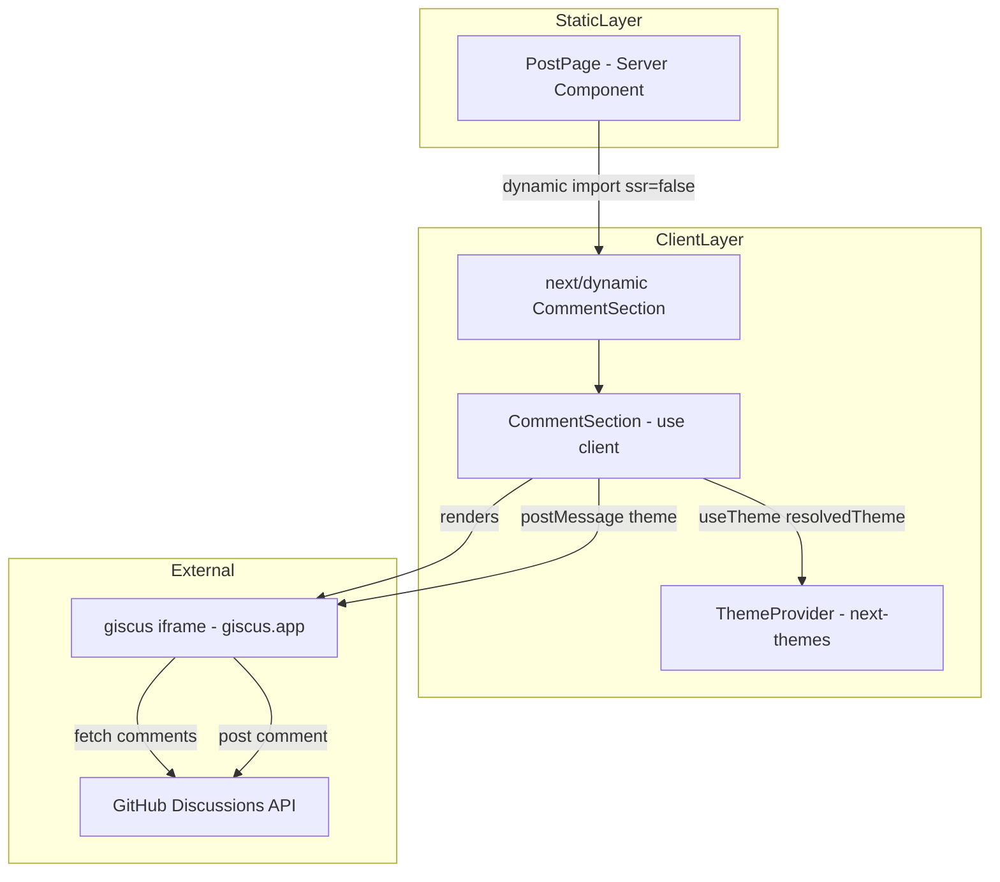
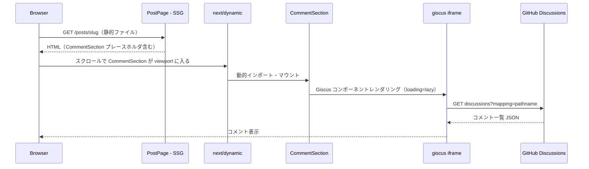
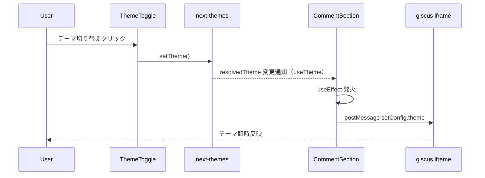

# Design Document: コメント機能

## Overview

本機能は、ブログ読者が各記事ページにコメントを投稿・閲覧できるようにする。GitHub Discussions をバックエンドとする OSS コメントシステム **giscus** を `@giscus/react` ラッパー経由で統合することで、認証・スパム対策・モデレーションをすべて GitHub プラットフォームに委ねる。ブログの SSG + Vercel Serverless アーキテクチャを完全に維持したまま、バックエンド追加なしで実現する。

**Users**: ブログ読者（コメント投稿・閲覧）とブログ著者（コメントのモデレーション）が対象。読者は GitHub アカウントを使って投稿し、著者は GitHub Discussions の管理 UI でモデレーションを行う。

**Impact**: `src/app/posts/[slug]/page.tsx` に `CommentSection` コンポーネントの挿入点が追加される。既存のページレイアウト・SSG・Lighthouse スコアへの影響を最小限に抑える。

### Goals

- GitHub Discussions を活用したコメント表示・投稿・管理を最小実装コストで実現する
- `next/dynamic` による遅延読み込みで Lighthouse Performance スコア 90+ を維持する
- `next-themes` の 3 状態テーマ（system/light/dark）と giscus テーマを完全同期する

### Non-Goals

- カスタムコメントフォーム UI（名前フィールドや 2000 文字制限）の実装（giscus の GitHub UI に委ねる）
- ブログ内でのコメント削除 UI（GitHub Discussions の管理 UI で行う）
- 匿名コメント対応
- カスタム通知システム（GitHub の通知機能で代替）

---

## Requirements Traceability

| 要件 | サマリ | コンポーネント | インターフェース | フロー |
|------|--------|----------------|-----------------|--------|
| 1.1 | コメントセクションを記事ページ末尾に表示 | CommentSection, PostPage | — | コメント表示フロー |
| 1.2 | コメントを投稿日時昇順で表示 | giscus（内部処理） | — | — |
| 1.3 | 投稿者名・日時・本文を表示 | giscus（内部処理） | — | — |
| 1.4 | 0件時の空状態メッセージ | giscus（内部処理） | — | — |
| 1.5 | ダークモード対応 | CommentSection | GiscusTheme | テーマ同期フロー |
| 2.1 | コメント保存と表示反映 | giscus（内部処理） | — | コメント投稿フロー |
| 2.2 | 名前・本文フォーム | giscus（GitHub フォーム） | — | — |
| 2.3 | 空フィールドのバリデーション | giscus（内部処理） | — | — |
| 2.4 | 文字数制限（GitHub 仕様に委ねる） | giscus（内部処理） | — | — |
| 2.5 | 超過エラーメッセージ | giscus（内部処理） | — | — |
| 2.6 | 送信成功後のフォームリセット | giscus（内部処理） | — | — |
| 2.7 | ネットワークエラー時の表示 | CommentSection | — | エラーハンドリング |
| 3.1 | bot 対策・認証 | giscus（GitHub OAuth） | — | — |
| 3.2 | GitHub 認証経由の投稿 | giscus（GitHub OAuth） | — | — |
| 3.3 | 未認証時の認証促進メッセージ | giscus（内部処理） | — | — |
| 3.4 | 重複コメント拒否 | giscus（内部処理） | — | — |
| 4.1 | 著者によるコメント削除 | GitHub Discussions UI | — | — |
| 4.2 | 削除の即時反映 | GitHub Discussions UI | — | — |
| 4.3 | 著者以外の削除禁止 | giscus（GitHub 権限） | — | — |
| 5.1 | 遅延読み込み | PostPage（next/dynamic） | DynamicCommentSection | コメント表示フロー |
| 5.2 | キーボード操作 | giscus（内部処理） | — | — |
| 5.3 | ARIA label | CommentSection | — | — |
| 5.4 | 二重送信防止 | giscus（内部処理） | — | — |
| 5.5 | Lighthouse 90+ 維持 | PostPage（next/dynamic） | — | — |

> 要件 2.2, 2.4, 2.5, 2.6, 4.1〜4.3 は giscus が GitHub プラットフォームとして満たす。ブログアプリ内のカスタム実装は不要。

---

## Architecture

### Existing Architecture Analysis

- **SSG**: `src/app/posts/[slug]/page.tsx` は `generateStaticParams` でビルド時に静的生成。コメントセクションのみクライアントサイドで動的ロード
- **クライアントコンポーネント**: `ViewCounter.tsx` が `'use client'` + `useEffect` + fetch パターンの先例。同パターンを踏襲する
- **テーマ**: `next-themes` の `ThemeProvider` がルートレイアウトに存在。`useTheme()` は `'use client'` コンポーネントから参照可能
- **`@upstash/redis`**: 閲覧数のみ管理。コメント用 API Route の追加は不要

### Architecture Pattern & Boundary Map



**Architecture Integration**:
- Selected pattern: クライアント専用遅延ロード（`next/dynamic` + `ssr: false`）
- Domain boundaries: コメント表示・投稿・認証・モデレーションはすべて giscus/GitHub 境界の外側
- Existing patterns preserved: `'use client'` + `useEffect`、`next-themes` `useTheme`
- New components: `CommentSection` のみ追加（新規 API Route・型定義ファイルは不要）
- Steering compliance: クライアントコンポーネントは必要最小限に限定（本要件は必須のインタラクションのため適切）

### Technology Stack

| Layer | Choice / Version | Role | Notes |
|-------|-----------------|------|-------|
| Frontend | `@giscus/react` ^3.1.0 | giscus React ラッパー | 新規依存関係。React 19 互換性はインストール時に確認 |
| Frontend | `next/dynamic` (Next.js 16 組み込み) | CommentSection の遅延読み込み | `ssr: false` でクライアント専用化 |
| Frontend | `next-themes` ^0.4.6（既存） | テーマ状態の取得 | `useTheme().resolvedTheme` を使用 |
| External | giscus.app | コメントの表示・投稿・認証 | GitHub Discussions ベース。リポジトリ public 要件あり |
| Storage | GitHub Discussions（外部） | コメントデータの永続化 | hiki-log リポジトリ内に作成 |
| Infra | Vercel（既存） | ホスティング。追加リソース不要 | 環境変数 `NEXT_PUBLIC_GISCUS_*` を追加 |

---

## System Flows

### コメント表示フロー



### テーマ同期フロー



---

## Components and Interfaces

### コンポーネントサマリ

| Component | Domain/Layer | Intent | Req Coverage | Key Dependencies | Contracts |
|-----------|-------------|--------|-------------|-----------------|-----------|
| CommentSection | UI / Client | giscus を包んでテーマ同期とアクセシビリティを担う | 1.1, 1.5, 2.7, 5.1, 5.3 | @giscus/react, useTheme（P0） | State |
| PostPage（既存拡張） | App / Server | CommentSection を動的インポートして記事末尾に挿入 | 5.1, 5.5 | next/dynamic（P0） | — |

---

### UI Layer

#### CommentSection

| Field | Detail |
|-------|--------|
| Intent | giscus コンポーネントをラップし、next-themes のテーマと同期させる |
| Requirements | 1.1, 1.5, 2.7, 5.1, 5.3 |

**Responsibilities & Constraints**
- `useTheme().resolvedTheme` を監視し、変更時に giscus iframe に postMessage でテーマを伝達する
- 初回マウント前（SSR / hydration 前）はコンポーネントを非表示にし、テーマ値 `undefined` による不一致を防止する
- `section[aria-label]` でコメントセクションをマークアップし、アクセシビリティ要件（5.3）を満たす
- `'use client'` ディレクティブを宣言する

**Dependencies**
- External: `@giscus/react` — giscus React ラッパー (P0)
- Inbound: `useTheme()` (next-themes) — resolvedTheme の取得 (P0)
- Inbound: 環境変数 `NEXT_PUBLIC_GISCUS_*` — giscus 設定値 (P0)

**Contracts**: State [x]

##### State Management

- State model:
  - `mounted: boolean` — hydration 完了フラグ。`false` の間はレンダリングをスキップする
  - `giscusTheme: 'light' | 'dark'` — `resolvedTheme` から導出。`undefined` の場合は `'light'` にフォールバック
- Persistence & consistency: giscus テーマは `resolvedTheme` に同期。postMessage は iframe 存在確認後に送信する
- Concurrency strategy: `useEffect` の依存配列に `resolvedTheme` を含め、変更のたびに postMessage を送信する

##### Props Interface

```typescript
/** CommentSection コンポーネントの Props */
type CommentSectionProps = {
  /** 対象記事のスラッグ（giscus の pathname マッピングに使用） */
  slug: string
}
```

##### giscus postMessage 型

```typescript
/** giscus iframe に送信するテーマ変更メッセージの型 */
type GiscusSetConfigMessage = {
  giscus: {
    setConfig: {
      theme: 'light' | 'dark'
    }
  }
}
```

**Implementation Notes**
- Integration: `next/dynamic` で `ssr: false` を指定して PostPage からインポートする。`loading` prop にプレースホルダ要素を指定してレイアウトシフトを防ぐ
- Validation: マウント前は `null` を返す。`iframe.contentWindow` が `null` の場合は postMessage をスキップする
- Risks: `@giscus/react` v3.1.0 が React 19 とのピア依存で警告を出す可能性あり。`npm install` 時に確認し、必要に応じて `overrides` を設定する

---

### App Layer（既存拡張）

#### PostPage（`src/app/posts/[slug]/page.tsx`）

既存の Server Component に以下の変更を加える:

```typescript
/** giscus の遅延読み込み用動的インポート定義（型のみ、実装は CommentSection に委ねる） */
const DynamicCommentSection: ComponentType<{ slug: string }>
// = next/dynamic(() => import('@/components/post/CommentSection'), { ssr: false, loading: () => <div /> })
```

- `<article>` の末尾（`<div className="prose">` の後）に `<DynamicCommentSection slug={post.slug} />` を挿入する
- 既存のレイアウト（max-w-5xl, 2カラム）に影響しない位置に配置する

**Implementation Notes**
- `article` 要素の内側、`<div className="prose">` の直後に挿入する
- デスクトップ 2 カラムレイアウト（`lg:flex`）の本文エリア（`flex-1`）に収まるため、レイアウト変更は不要

---

## Data Models

### Domain Model

コメントデータはすべて GitHub Discussions に格納される。ブログアプリ内にコメントのデータモデルは存在しない。

**記事とディスカッションのマッピング**:
- `mapping: "pathname"` を使用
- 記事 `/posts/my-article` → `pathname: /posts/my-article` のディスカッションに紐付く
- 記事公開後に初回コメントが投稿されると GitHub 側でディスカッションが自動作成される

### 環境変数定義

| 変数名 | 型 | 説明 |
|--------|---|------|
| `NEXT_PUBLIC_GISCUS_REPO` | `string` | GitHubリポジトリ（例: `m1kekad0/hiki-log`） |
| `NEXT_PUBLIC_GISCUS_REPO_ID` | `string` | GitHub リポジトリ ID（giscus.app で取得） |
| `NEXT_PUBLIC_GISCUS_CATEGORY` | `string` | Discussions カテゴリ名（例: `Comments`） |
| `NEXT_PUBLIC_GISCUS_CATEGORY_ID` | `string` | Discussions カテゴリ ID（giscus.app で取得） |

> `NEXT_PUBLIC_` プレフィックスはクライアントサイドでの参照に必要。これらは公開情報であり、Upstash API キーとは異なりクライアント露出が許容される。

---

## Error Handling

### Error Strategy

giscus コンポーネントは内部でエラー処理を行う。ブログアプリ側の責務は、giscus が読み込めない場合にページ全体を壊さないことのみ。

### Error Categories and Responses

- **ネットワークエラー（要件 2.7）**: giscus.app が到達不能な場合、giscus iframe 内でエラーメッセージが表示される。ブログのメインコンテンツには影響なし。`next/dynamic` の `loading` prop で表示するプレースホルダを用意する
- **環境変数未設定**: `NEXT_PUBLIC_GISCUS_REPO` 等が未設定の場合、giscus が正常に初期化されない。Vercel 環境変数の設定漏れを防ぐため、`.env.example` を提供する
- **React 19 互換性警告**: `npm install` 時に peer dependency 警告が出る場合は `package.json` の `overrides` で解決する

### Monitoring

- giscus のロードエラーはブラウザの開発者コンソールに出力される
- コメント数や活動の監視は GitHub Discussions の通知機能で行う

---

## Testing Strategy

### Unit Tests

現状テストコードは存在しないため、本機能もテストコードは作成しない（要件外）。

### E2E / 手動確認

- [ ] `/posts/[slug]` ページを開いてスクロールすると giscus iframe が読み込まれる
- [ ] ライトモード → ダークモード切り替え時に giscus のテーマが即時変わる
- [ ] システムテーマ（system）設定時、OS の設定に応じた giscus テーマが適用される
- [ ] 記事ページの Lighthouse Performance スコアが 90 以上である
- [ ] コメントセクションがキーボードのみで操作できる（Tab 移動）

---

## Security Considerations

- `NEXT_PUBLIC_GISCUS_*` 環境変数はクライアントに公開されるが、GitHub リポジトリ ID やカテゴリ ID は公開情報であり問題ない
- giscus への postMessage は `'https://giscus.app'` を origin として指定し、不正な送信先への誤送信を防止する
- コメント内のスクリプトインジェクションは giscus が GitHub Markdown レンダリングを通じて対処する

---

## Performance & Scalability

- `next/dynamic(() => import(...), { ssr: false })` により、記事ページの初期バンドルサイズに `@giscus/react` は含まれない
- giscus の `loading="lazy"` により、viewport 外ではスクリプトがロードされない
- コメントデータは GitHub CDN から配信されるため、ブログのインフラに負荷がかからない
- Lighthouse スコアへの影響: giscus の `loading="lazy"` と動的インポートの組み合わせにより、LCP・FID への影響を最小化する
