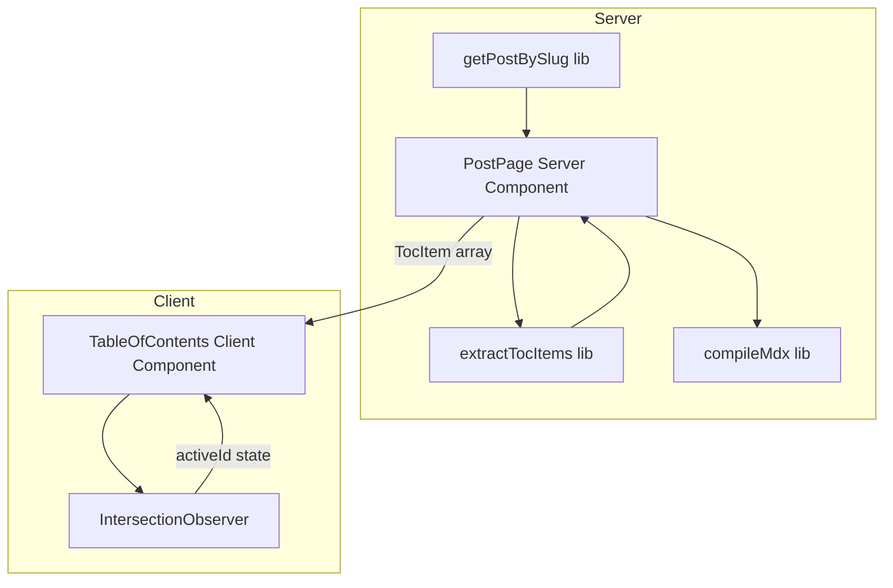
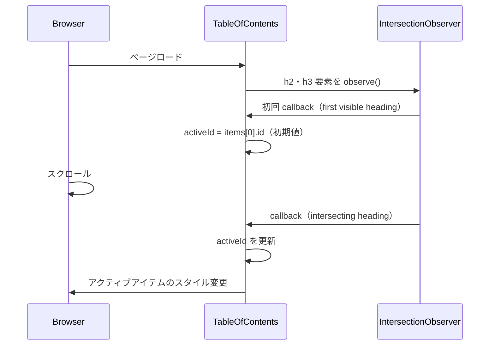

# Design Document: table-of-contents

---

## Overview

本機能は、記事詳細ページ（`/posts/[slug]`）に目次（Table of Contents）を自動生成・表示する。
長い技術記事において読者が全体構成を素早く把握し、目的のセクションへ直接ジャンプできるようにする。

**Purpose**: 記事の h2・h3 見出しから目次を抽出し、アンカーリンクとスクロール連動ハイライトを提供することで読者体験を向上させる。
**Users**: ブログ読者（不特定多数）が、長い技術記事を効率よく閲覧する際に利用する。
**Impact**: 記事詳細ページのレイアウトをデスクトップ 2 カラム構成に変更し、`src/lib/toc.ts` と `src/components/post/TableOfContents.tsx` を新規追加する。

### Goals

- Markdown 本文から h2・h3 を抽出し、`rehype-slug` と一致する ID を生成する
- デスクトップでスティッキーサイドバーとして、モバイルで折りたたみ形式として目次を表示する
- スクロール位置に連動して現在のセクションを目次上でハイライトする
- WCAG 準拠のアクセシビリティを維持する

### Non-Goals

- h4 以下の見出しレベルの対応（h2・h3 のみ）
- サーバーサイドレンダリングでのスクロール追跡（クライアント専用）
- 本文全文のアウトライン表示や折りたたみ展開
- 目次の印刷・エクスポート対応

---

## Requirements Traceability

| Requirement | Summary | Components | Interfaces | Flows |
|-------------|---------|------------|------------|-------|
| 1.1 | h2・h3 を本文から抽出 | `extractTocItems()` | `TocItem[]` | — |
| 1.2 | テキストと ID を取得 | `extractTocItems()` + `github-slugger` | `TocItem.id`, `TocItem.text` | — |
| 1.3 | 見出し 2 未満なら非表示 | `PostPage`（条件分岐） | — | — |
| 1.4 | h2/h3 の階層構造を保持 | `extractTocItems()` | `TocItem.level` | — |
| 2.1 | 階層インデント付きリンクリスト | `TableOfContents` | `TableOfContentsProps` | — |
| 2.2 | スムーズスクロール | `TableOfContents`（CSS） | — | スクロールフロー |
| 2.3 | 記事本文の前または横に配置 | `PostPage` レイアウト変更 | — | — |
| 2.4 | アンカー URL 付与 | `TableOfContents` | `href="#id"` | — |
| 3.1 | スクロール連動ハイライト | `TableOfContents`（IntersectionObserver） | `activeId` state | スクロールフロー |
| 3.2 | 初期アクティブ状態 | `TableOfContents` | `activeId` 初期値 | — |
| 3.3 | アクティブ切り替え | `TableOfContents` | `activeId` 更新 | — |
| 4.1 | デスクトップでスティッキー表示 | `PostPage` + `TableOfContents` | Tailwind `lg:` クラス | — |
| 4.2 | モバイルで折りたたみ | `TableOfContents` | `isOpen` state | — |
| 4.3 | トグルボタンで展開・折りたたみ | `TableOfContents` | `isOpen` state | — |
| 4.4 | モバイルデフォルト折りたたみ | `TableOfContents` | `isOpen` 初期値 `false` | — |
| 5.1 | `<nav aria-label="目次">` | `TableOfContents` | ARIA 属性 | — |
| 5.2 | キーボード操作 | `TableOfContents`（`<a>` タグ） | — | — |
| 5.3 | `aria-expanded` | `TableOfContents` | トグルボタン属性 | — |
| 5.4 | `aria-current="true"` | `TableOfContents` | アクティブアイテム属性 | — |

---

## Architecture

### Existing Architecture Analysis

- 記事詳細ページはサーバーコンポーネント（SSG）として実装されており、`getPostBySlug()` でデータを取得している
- `compileMdx()` が `next-mdx-remote/rsc` を呼び出し、`rehype-slug` が見出しに `id` を付与している
- クライアントコンポーネントは `ViewCounter`（`useEffect` + `useState`）等が確立するパターンに準拠している

### Architecture Pattern & Boundary Map



**Architecture Integration**:
- 選択パターン: Extension — 既存サーバーコンポーネント構造を拡張しクライアントコンポーネントを追加
- 境界: 見出し抽出・MDX コンパイルはサーバーサイド、スクロール追跡・インタラクションはクライアントサイド
- 既存パターンを維持: `src/lib/` にロジックを集約、`src/components/post/` にコンポーネントを配置
- 新規コンポーネントの根拠: スクロール追跡にはブラウザ API が必要なため `'use client'` 必須

### Technology Stack

| Layer | Choice / Version | Role in Feature | Notes |
|-------|------------------|-----------------|-------|
| UI | React 19 + TypeScript 5 | `TableOfContents` クライアントコンポーネント | 既存スタック |
| スタイリング | Tailwind CSS v4 | レスポンシブレイアウト・アクティブスタイル | 既存スタック |
| スラッグ生成 | `github-slugger` v2.0.0 | 見出し ID の生成（`rehype-slug` と一致保証） | direct dep に追加（現在はトランジティブ） |
| ブラウザ API | `IntersectionObserver` | スクロール連動アクティブ検出 | 全モダンブラウザ対応・polyfill 不要 |

---

## System Flows

### スクロール連動フロー



---

## Components and Interfaces

| Component | Domain/Layer | Intent | Req Coverage | Key Dependencies | Contracts |
|-----------|--------------|--------|-------------|------------------|-----------|
| `extractTocItems` | lib / server | Markdown から `TocItem[]` を抽出する | 1.1, 1.2, 1.3, 1.4 | `github-slugger` (P0) | Service |
| `TableOfContents` | post / client | TOC の表示・ジャンプ・スクロール追跡 | 2.1–2.4, 3.1–3.3, 4.1–4.4, 5.1–5.4 | `TocItem[]` prop (P0) | State |
| `PostPage` (変更) | app / server | `extractTocItems` を呼び出し、レイアウトを 2 カラム化 | 1.3, 2.3, 4.1 | `extractTocItems` (P0), `TableOfContents` (P1) | — |

---

### lib / server

#### extractTocItems

| Field | Detail |
|-------|--------|
| Intent | Markdown 文字列を解析し、h2・h3 の見出しを `TocItem[]` として返す |
| Requirements | 1.1, 1.2, 1.3, 1.4 |

**Responsibilities & Constraints**
- `##` と `###` プレフィックスの行から見出しテキストを抽出する
- `GithubSlugger` を使って `rehype-slug` と同一の `id` を生成する
- ID が空文字のアイテム（日本語のみ見出し等）を除外する
- 同一テキストの見出しが複数ある場合、`GithubSlugger` が `-1`, `-2` サフィックスで一意化する

**Dependencies**
- External: `github-slugger` — `GithubSlugger` クラスによる ID 生成（P0）

**Contracts**: Service [x] / API [ ] / Event [ ] / Batch [ ] / State [ ]

##### Service Interface

```typescript
/** 目次アイテムの型 */
type TocItem = {
  /** rehype-slug と一致するアンカー ID */
  id: string
  /** 見出しの表示テキスト（Markdown 記法除去済み） */
  text: string
  /** 見出しレベル（h2 = 2、h3 = 3） */
  level: 2 | 3
}

/**
 * Markdown 本文から h2・h3 の見出しを抽出し TocItem 配列を返す。
 * @param markdown - 記事の raw Markdown 文字列
 * @returns TocItem の配列。ID が空のアイテムは除外される。
 */
function extractTocItems(markdown: string): TocItem[]
```

- Preconditions: `markdown` は空文字可。空文字または見出しなしの場合は空配列を返す
- Postconditions: 返り値の各 `id` は `rehype-slug` が付与する `id` と一致する
- Invariants: `level` は必ず `2` または `3` のいずれか

**Implementation Notes**
- Integration: `src/lib/toc.ts` として新規作成。`src/app/posts/[slug]/page.tsx` からインポートする
- Validation: 正規表現 `/^#{2,3} (.+)$/m` で見出し行を抽出する。インラインコード記号（`` ` ``）や太字（`**`）は表示テキストとしてそのまま含める（シンプル化のため）
- Risks: 日本語のみの見出しは ID が空になる。`id !== ''` のフィルタで除外する

---

### post / client

#### TableOfContents

| Field | Detail |
|-------|--------|
| Intent | TOC の表示・スムーズスクロール・スクロール連動ハイライト・レスポンシブ対応・アクセシビリティを提供するクライアントコンポーネント |
| Requirements | 2.1, 2.2, 2.3, 2.4, 3.1, 3.2, 3.3, 4.1, 4.2, 4.3, 4.4, 5.1, 5.2, 5.3, 5.4 |

**Responsibilities & Constraints**
- `items` props（`TocItem[]`）を受け取り、`<nav>` でラップしたリンクリストをレンダリングする
- `IntersectionObserver` で `.prose h2, .prose h3` を監視し、`activeId` を管理する
- モバイル時は `isOpen` state でトグル表示を管理する（デフォルト `false`）
- デスクトップ用スタイルは Tailwind `lg:` クラス、モバイル用スタイルはデフォルトクラスで定義する

**Dependencies**
- Inbound: `PostPage` — `TocItem[]` を props として受け取る（P0）
- External: `IntersectionObserver` ブラウザ API — アクティブ見出し検出（P0）

**Contracts**: Service [ ] / API [ ] / Event [ ] / Batch [ ] / State [x]

##### State Management

- State model:

  | state | 型 | 初期値 | 役割 |
  |-------|----|--------|------|
  | `activeId` | `string` | `items[0]?.id ?? ''` | 現在アクティブな見出し ID |
  | `isOpen` | `boolean` | `false` | モバイルでの展開状態 |

- Persistence & consistency: state はコンポーネントのライフタイムのみ。ページ遷移でリセット
- Concurrency strategy: `IntersectionObserver` コールバックは同期的に `activeId` を更新する

##### Service Interface

```typescript
/** TableOfContents コンポーネントの Props */
type TableOfContentsProps = {
  /** 表示する目次アイテムの配列 */
  items: TocItem[]
}
```

**Implementation Notes**
- Integration:
  - `'use client'` ディレクティブを先頭に宣言する
  - `useEffect` 内で `document.querySelectorAll('.prose h2, .prose h3')` を観察対象として `IntersectionObserver` を生成する
  - `rootMargin: '-80px 0px -70% 0px'` でアクティブ検出帯域を設定する
  - クリーンアップ: `useEffect` の return で `observer.disconnect()` を呼ぶ
- Validation: `items` が空の場合はコンポーネントを `null` 返却する（呼び出し側でも 2 件未満チェックを行うが二重防衛）
- Risks: Header が `sticky` の場合、スクロール計算に `scroll-margin-top` CSS が必要になる可能性がある

---

### app / server（変更）

#### PostPage（変更）

| Field | Detail |
|-------|--------|
| Intent | `extractTocItems` を呼び出し、2 カラムレイアウトで `TableOfContents` を統合する |
| Requirements | 1.3, 2.3, 4.1 |

**変更スコープ**
- `extractTocItems(post.content)` を呼び出して `tocItems` を生成する
- `tocItems.length >= 2` の場合のみ `TableOfContents` をレンダリングする
- アウターコンテナを `lg:flex lg:items-start lg:gap-10` に変更し、記事本文とサイドバーを並列配置する

**レイアウト構造（変更後）**

```
div.mx-auto.max-w-5xl           ← outer wrapper（max-w-4xl から拡張）
  div.lg:flex.lg:items-start.lg:gap-10
    article.flex-1.min-w-0     ← 記事コンテンツ（モバイル TOC はこの先頭）
      div.lg:hidden             ← モバイル TOC（lg 以上で非表示）
        TableOfContents
      header
      div.prose
        {content}
    aside.hidden.lg:block       ← デスクトップ TOC サイドバー（lg 未満で非表示）
      div.sticky.top-24
        TableOfContents
```

> モバイルとデスクトップで同一コンポーネントインスタンスを 2 か所レンダリングする（Tailwind の `hidden`/`block` で表示切り替え）。

**Implementation Notes**
- Risks: `max-w-5xl` への変更が他ページ（root layout の `max-w-4xl`）と若干ずれる可能性がある。記事詳細ページのみのローカル変更であり影響範囲は限定的

---

## Data Models

### Domain Model

`TocItem` は値オブジェクトとして扱う。不変であり、ページロード時に一度だけ生成される。

```
TocItem
  id: string      — rehype-slug が付与する id と一致するアンカー識別子
  text: string    — 見出しの表示テキスト
  level: 2 | 3   — 見出しの階層レベル
```

### Logical Data Model

- `TocItem[]` はサーバーサイドで生成され、props として `TableOfContents` に渡される
- 永続化なし（SSG 時に計算されページ HTML に埋め込まれる）

---

## Error Handling

### Error Strategy

TOC はユーティリティ機能であり、失敗してもページ表示を妨げてはならない。**グレースフルデグラデーション**を原則とする。

### Error Categories and Responses

| エラー種別 | 条件 | 対応 |
|----------|------|------|
| 見出し抽出失敗 | `extractTocItems` が例外を投げた場合 | 呼び出し側で `try/catch` し、`tocItems = []` として TOC を非表示にする |
| DOM 要素未発見 | `querySelectorAll` が 0 件を返した場合 | `IntersectionObserver` を生成しない（activeId は初期値のまま） |
| `IntersectionObserver` 未対応 | 古い環境（ほぼ発生しない） | `typeof IntersectionObserver !== 'undefined'` チェックでスキップ |

### Monitoring

- エラーログは既存の Vercel ログに委ねる。TOC の失敗は警告レベル（記事閲覧には影響しない）

---

## Testing Strategy

### Unit Tests

現状テストコードなし（steering `tech.md` 記載）。本機能でも Unit Test は必須要件外だが、以下を実装時の動作確認項目とする。

- `extractTocItems` の主要パターン:
  - h2・h3 混在記事からの正しい抽出
  - 見出しなしの場合に空配列が返ること
  - 重複見出しテキストで `-1` サフィックスが付与されること
  - 日本語のみの見出しが除外されること

### E2E / 目視確認

- デスクトップ: TOC がサイドバーとして表示され、スクロールで追従する
- モバイル: TOC がデフォルト折りたたみ状態で表示され、トグルで展開・折りたたみできる
- 目次リンクをクリックすると対応する見出しにスムーズスクロールする
- 見出しが 2 未満の記事では TOC が非表示になる

---

## Performance & Scalability

- `IntersectionObserver` はネイティブ API であり `scroll` イベントリスナーより軽量
- `extractTocItems` はビルド時に実行（SSG）されるため、ランタイムコストは発生しない
- TOC コンポーネントのレンダリングコストは `items` 配列のサイズに比例するが、通常の技術記事（30 見出し以下）では無視できるレベル
